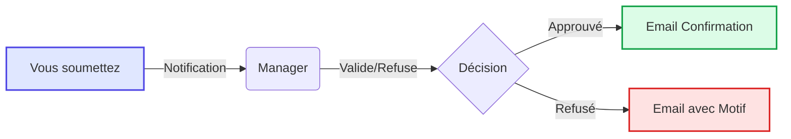
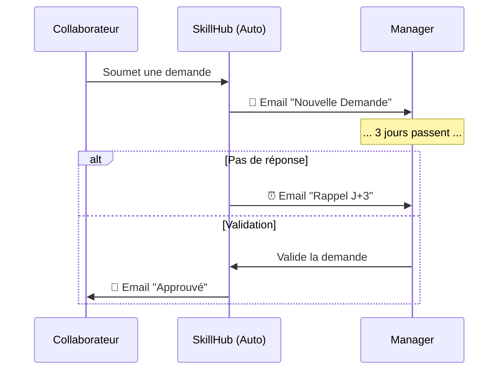

# Guide des Automatisations SkillHub

Ce guide explique les notifications et actions automatiques que SkillHub effectue pour vous faire gagner du temps et assurer le bon suivi des demandes de formation.

## 1. Vue d'ensemble

SkillHub travaille pour vous en arrière-plan. Notre système d'automatisation (connecté via Make.com) s'assure que la bonne personne est informée au bon moment.

---

## 2. Pour le Collaborateur

### Quand je soumets une demande
Dès que vous cliquez sur "Envoyer la demande", SkillHub :
1.  Change le statut de la demande à `En attente Manager`.
2.  **Envoie automatiquement un email à votre Manager** avec les détails de la formation et un lien direct pour la valider.

### Quand ma demande est traitée
Vous n'avez pas besoin de relancer sans cesse. Vous recevez un email automatique dès qu'une décision est prise :
*   **Si Approuvée ✅** : Vous recevez un email de confirmation. Les RH prendront le relais pour l'inscription.
*   **Si Refusée ❌** : Vous recevez une notification avec le **motif du refus** expliqué par votre Manager ou les RH.

---

## 3. Pour le Manager

### Quand un collaborateur fait une demande
Vous recevez un email instantané contenant :
*   Le nom du collaborateur.
*   Le titre et le coût de la formation.
*   **Un lien direct** pour valider ou refuser la demande en un clic.

### Le "Filet de Sécurité" (Rappels)
Si vous oubliez de traiter une demande, pas de panique :
*   **J+3** : Si une demande est en attente depuis plus de 3 jours ouvrés, SkillHub vous envoie un **email de rappel** automatique chaque matin à 10h00 jusqu'à ce qu'elle soit traitée.

---

## 4. Pour les RH

### Validation Finale
Une fois validée par le Manager, la demande arrive dans votre bannette "À Valider RH".
*   Le Manager ne reçoit pas de notification à cette étape (pour éviter le spam), mais le statut est mis à jour dans son tableau de bord.

### Génération de Documents (Bientôt disponible)
Dans les prochaines versions, SkillHub générera automatiquement les conventions de formation pré-remplies au format PDF dès votre validation.

---

## Résumé des Notifications

| Événement | Qui reçoit ? | Canal | Contenu |
| :--- | :--- | :--- | :--- |
| **Nouvelle Demande** | Manager | Email | Détails + Lien de validation |
| **Demande Approuvée** | Collaborateur | Email | Confirmation de validation |
| **Demande Refusée** | Collaborateur | Email | Motif du refus |
| **Retard Validation (>3j)** | Manager | Email | Rappel des demandes en attente |
